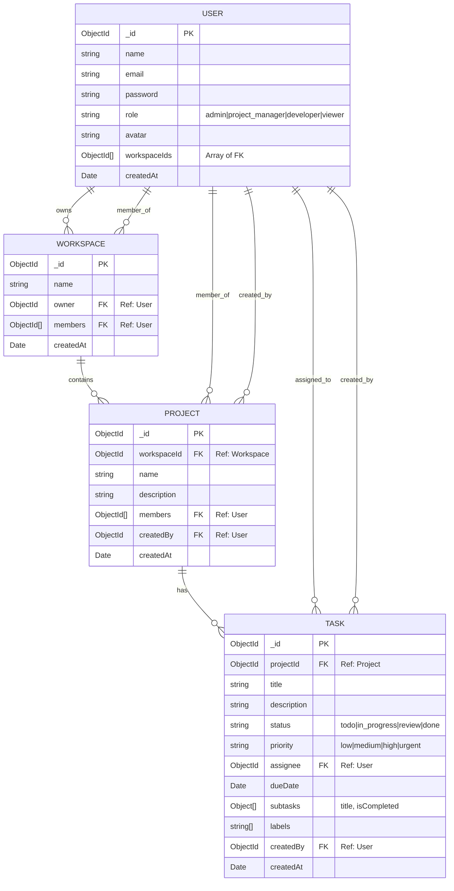
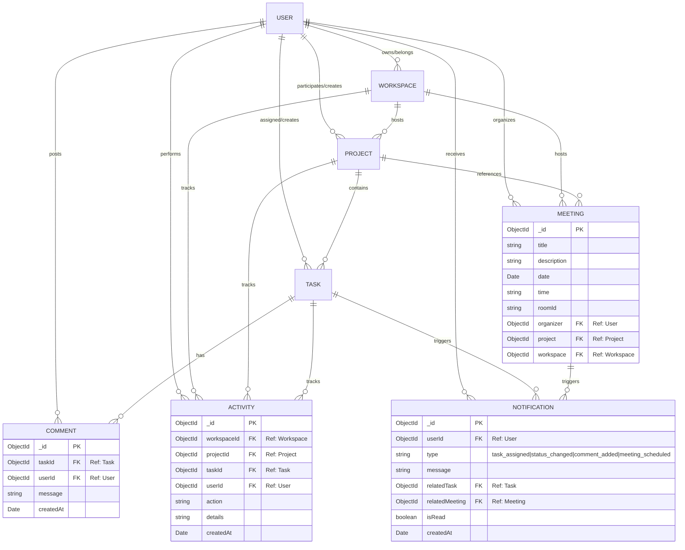

# SLIQ Project - Detailed Database ER Diagrams

This document provides a comprehensive A-Z breakdown of the database architecture for the SLIQ project. The diagrams are generated using Mermaid and represent the MongoDB schema relationships across all entities.

---

## 1. Core Architecture Overview
This diagram focuses on the primary relationship between Users, Workspaces, Projects, and Tasks. These are the cornerstones of the SLIQ application hierarchy.

---

## 2. Full System Entity-Relationship Diagram (A-Z)
This diagram includes all system entities: Users, Workspaces, Projects, Tasks, Comments, Meetings, Notifications, and Activities.

---

## 3. Data Dictionary

### User Model
The central point of authentication and authorization.
- **_id**: Unique identifier.
- **role**: Defines access levels (Admin, PM, Developer, Viewer).
- **workspaceIds**: Junction field for quick access to associated workspaces.

### Workspace Model
The top-level organizational container.
- **owner**: Tracks who has primary control.
- **members**: Array of IDs for multi-user collaboration.

### Project Model
Specific initiatives within a Workspace.
- **workspaceId**: Links the project to its parent container.
- **members**: Project-specific access control.

### Task Model
The primary unit of work.
- **projectId**: Links task to its project.
- **assignee**: THE user responsible for the task.
- **status/priority**: Enums for kanban/list workflows.

### Comment Model
Facilitates communication.
- **taskId**: Links the comment to a specific work item.

### Meeting Model
Collaboration and scheduling.
- **roomId**: Unique identifier for virtual rooms.
- **project/workspace**: Contextual links for where the meeting belongs.

### Notification Model
User engagement and updates.
- **userId**: The recipient.
- **relatedTask/Meeting**: Contextual links to the source of the notification.

### Activity Model
The system's audit log.
- **action**: Describes what happened (e.g., 'task_moved').
- **workspace/project/task**: Full path of where the activity occurred.

---

## 4. Relationship Logic
- **Hierarchical**: Workspace > Project > Task > Comment.
- **Cross-Cutting**: User connects to every major entity.
- **Observational**: Activity and Notification track changes across the hierarchy.
